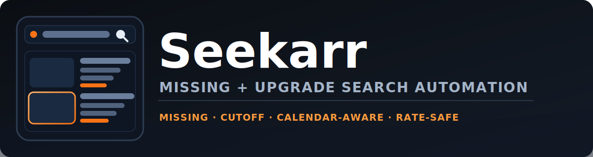

# Seekarr

<p align="center">
  
</p>

<p align="center">
  <a href="https://github.com/tumeden/seekarr/actions/workflows/ci.yml"></a>
  <a href="https://github.com/tumeden/seekarr/releases"></a>
  
  
  
  <a href="https://hub.docker.com/r/tumeden/seekarr"></a>
  <a href="https://ko-fi.com/tumeden"></a>
  
</p>

Seekarr automatically triggers Radarr/Sonarr searches for items already in your library (missing and/or cutoff-unmet), on a schedule, with cooldown + rate limits to avoid API spam.

Looking to clean up stuck or failed downloads? Check out https://github.com/ManiMatter/decluttarr

Scope:
- Focused strictly on automatic searching via Sonarr/Radarr.
- No unrelated "arr suite" features (download cleanup, etc).

Transparency:
- Built with significant AI assistance. Review and use at your own discretion.

<!-- screenshots -->


---

## What It Does

- Pulls "wanted" lists from Radarr/Sonarr (missing and/or cutoff-unmet).
- Triggers searches per instance on its interval.
- Remembers what it already searched (SQLite cooldown) so it will not retry the same item constantly.
- Paces requests so large libraries do not cause bursts.
- Skips unreleased content (default: wait 8 hours after air/release).
- Uses smart calendar-aware prioritization (already-aired/released near-now items are searched first in `search_order: smart`).
- For recent releases (past 2 days), retries are more aggressive and cycles can wake early when `air/release + min_hours_after_release` is reached.
- Can pause searching during quiet hours (default: 23:00 to 06:00). Set `app.quiet_hours_timezone` to pin the timezone (IANA name like `America/New_York`, or fixed offset like `-05:00`).

Sonarr missing mode defaults to `smart`:
- Empty/mostly-empty seasons prefer season-pack searches.
- Partial seasons can fall back to episode-level searches.
- If a season-pack key is on cooldown, Smart skips that season and moves on (instead of episode-searching the same cooled-down season).

---

## Quick Start (Config)

1. Create your config:

```bash
cp config.example.yaml config.yaml
```

2. Edit `config.yaml` and set your Arr URLs:

- If Seekarr runs on a different machine than Radarr/Sonarr, do not use `localhost`.
- Use an IP/hostname Seekarr can reach (example: `http://192.168.1.50:7878`).

3. Open Web UI and configure everything from **Settings**:

- Arr URL
- Arr API key (stored encrypted in SQLite)
- Quiet hours start/end/timezone
- Search behavior/rate/interval settings

---

## Docker (Easiest)

Seekarr publishes Docker images. `:latest` tracks the newest `v*` release tag.

Pull:

```bash
docker pull tumeden/seekarr:latest
```

Minimal `docker-compose.yml` (Web UI):

```yaml
services:
  seekarr:
    image: tumeden/seekarr:latest
    container_name: seekarr
    restart: unless-stopped
    ports:
      - "8788:8788"
    volumes:
      - ./data:/data
```

Notes:
- Persist `./data` (it contains `config.yaml`, `seekarr.db`, and `seekarr.masterkey`).
- Seekarr auto-creates `./data/config.yaml` on first start if it is missing.
- Web UI settings are persisted in `seekarr.db` (SQLite), not written back to `config.yaml`.
- Quiet hours use your configured `app.quiet_hours_timezone` (if set), otherwise the container timezone.
- First load prompts you to set a Web UI password (stored as a salted hash in SQLite).
- Put keys/password in `./data/.env` only if you want to pre-seed them (optional):

```env
SEEKARR_WEBUI_PASSWORD=change-me
RADARR_API_KEY_1=your-radarr-key
SONARR_API_KEY_1=your-sonarr-key
```

Permissions note (Docker/Portainer):
- Seekarr runs as a non-root user (UID `10001`). Your `/data` volume must be writable by that user.
- Bind mount example (host path `/opt/seekarr`):

```bash
sudo mkdir -p /opt/seekarr
sudo chown -R 10001:10001 /opt/seekarr
sudo chmod -R u+rwX /opt/seekarr
```

---

## Security And Credentials (How It Works)

On first load of the Web UI, Seekarr prompts you to set a password. This password is stored as a salted PBKDF2 hash in the SQLite DB (it is not reversible and is never returned by the UI/API). If you forget it, there is no "forgot password" flow.

Seekarr stores Arr API keys you enter in the Web UI encrypted in the same SQLite DB. The encryption key is auto-generated on first run and stored in `seekarr.masterkey` next to the DB (for Docker, that lives in your `./data` volume). If you delete or lose `seekarr.masterkey`, Seekarr cannot decrypt the saved Arr API keys and you will need to re-enter them.

If you forget your Web UI password, reset it by deleting the stored password hash:
- Simple reset (wipes Seekarr state): stop Seekarr and delete `seekarr.db` in your data directory, then start Seekarr again.
- Advanced reset (keeps state): stop Seekarr, open `seekarr.db` with a SQLite tool, and delete the row from the `webui_auth` table.

---

## Windows (Quick Run)

1. Install Python 3.11+
2. Install deps:

```bat
python -m pip install -r requirements.txt
```

3. Run (pick one):
- `run.bat`

---

## Common Errors

- Connection refused/unreachable: the Arr URL/port is wrong, or Radarr/Sonarr is not reachable from where Seekarr runs.
- HTTP 401/403: API key is wrong or lacks permission.

---

## Technical Notes

- The Web UI binds to localhost by default. `--allow-public` is required to bind to non-localhost, to avoid accidentally exposing `/api/*` endpoints.
- The Web UI password is stored as a salted hash in the SQLite DB (it cannot be retrieved via the API/UI).
- API keys set in the Web UI are stored encrypted in the SQLite DB (they cannot be retrieved via the API/UI).
- API key encryption uses a master key file stored next to the DB: `seekarr.masterkey`. If you lose this file, you must re-enter API keys.
- `config.yaml` supports `${ENV_VAR}` interpolation.

