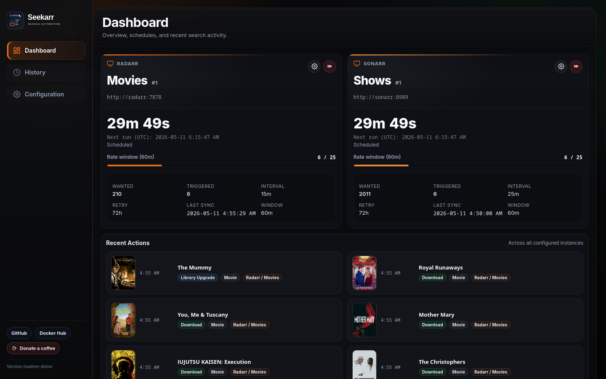
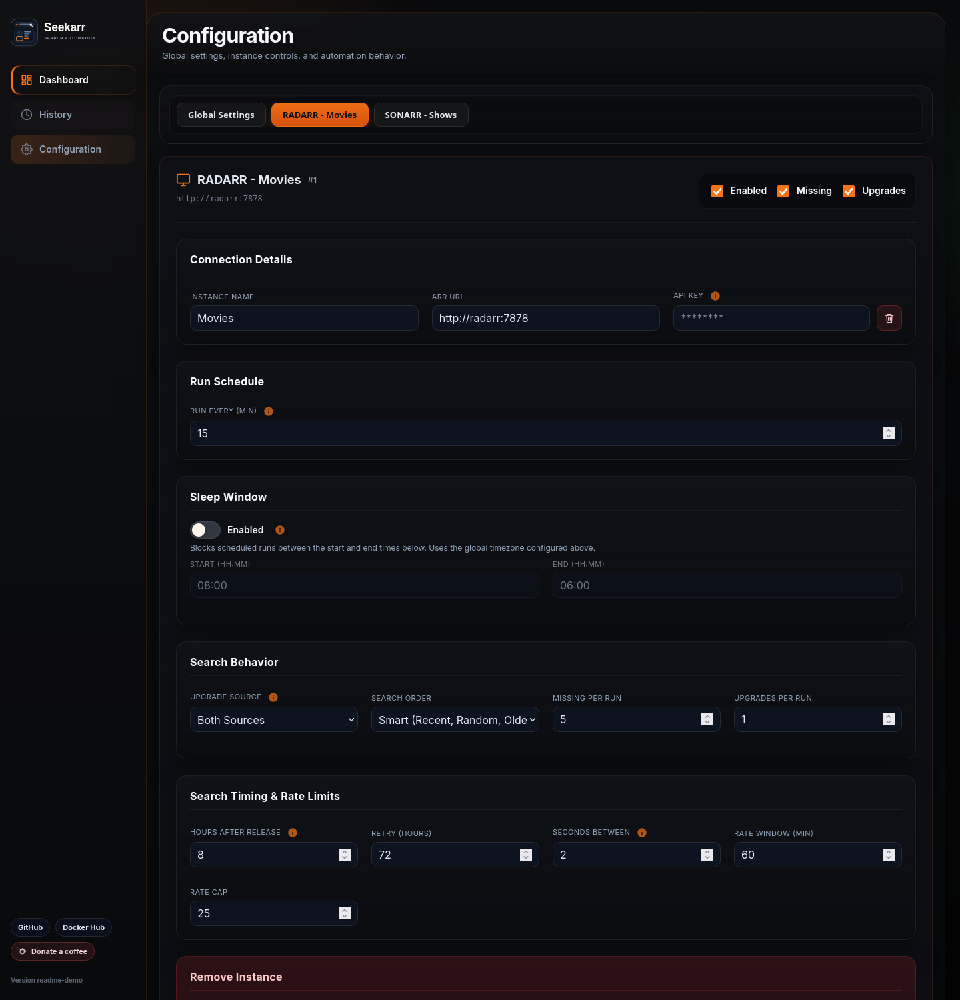
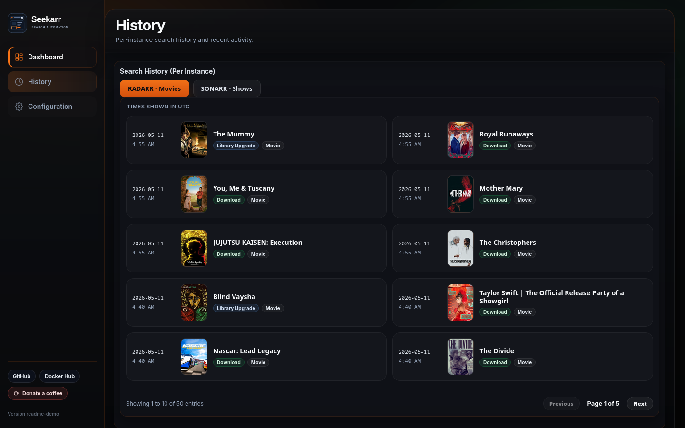
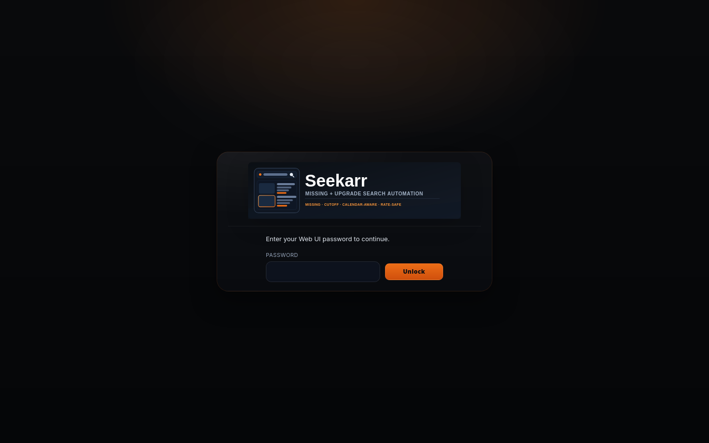

# Seekarr

<p align="center">
  
</p>

<p align="center">
  <a href="https://github.com/tumeden/seekarr/actions/workflows/quality.yml"></a>
  <a href="https://github.com/tumeden/seekarr/actions/workflows/security.yml"></a>
  <a href="https://github.com/tumeden/seekarr/actions/workflows/docker.yml"></a>
  <a href="https://github.com/tumeden/seekarr/actions/workflows/workflow-lint.yml"></a>
  <a href="https://github.com/tumeden/seekarr/actions/workflows/dockerfile-lint.yml"></a>
  <a href="https://github.com/tumeden/seekarr/releases"></a>
  
  
  
  <a href="https://hub.docker.com/r/tumeden/seekarr"></a>
  <a href="https://github.com/tumeden/seekarr/pkgs/container/seekarr"></a>
  <a href="https://ko-fi.com/tumeden"></a>
  
</p>

Seekarr keeps Radarr and Sonarr looking for what they missed.

If a movie or episode stays missing after the first search, Seekarr checks again later. If something downloaded but you still want a better release, Seekarr can keep looking for that too.

Add your Radarr and Sonarr instances, choose how often each one should run, and let Seekarr do the repeat searching in the background.

## Why It Exists

Radarr and Sonarr are good at managing libraries, but sometimes an item just sits there missing. Maybe it was not available yet. Maybe your indexer missed it. Maybe you wanted to try again later without opening the app and clicking search yourself.

I made Seekarr to sit beside Radarr and Sonarr and handle that repeat-search work. It is not trying to replace them. It just gives them another nudge on a schedule you control.

Seekarr helps when:

- A movie or episode stays missing after the first search.
- You do not want to keep opening Radarr or Sonarr just to click search again.
- You want Seekarr to keep checking for better releases after something has already downloaded.
- You have more than one Radarr or Sonarr instance and want Seekarr to run searches for each one.
- You want repeat searching to happen quietly in the background without flooding your indexers.

## How It Works

1. Connect Seekarr to Radarr and/or Sonarr with their API keys.
2. Pick how often each instance should run.
3. Choose whether Seekarr should look for missing items, better releases, or both.
4. Seekarr checks each instance on schedule and triggers searches when an item is eligible.
5. The dashboard shows what ran, what searched, and what is coming up next.

## Screenshots

<p>
  
</p>

<p>
  
</p>

<details>
<summary>More screenshots</summary>

<p>
  
</p>

<p>
  
</p>

</details>

## What It Does

- Missing search: retry movies and episodes that Radarr or Sonarr still does not have.
- Better release search: keep looking for improved releases after something has already downloaded.
- Per-instance schedules: run Movies, Shows, 4K, Anime, or any other Arr instance on its own timing.
- Sonarr search modes: search by episode, season pack, or show batch depending on how you want missing episodes handled.
- Safety controls: use quiet hours, retry delays, release delays, and rate caps so repeat searching stays controlled.
- Web UI configuration: manage instances, schedules, history, and search behavior from the browser.
- Encrypted API keys: Arr API keys are stored encrypted in SQLite.

For better-release searching, Seekarr can follow what Radarr/Sonarr already wants upgraded, check existing library items again, or combine both approaches.

## Docker Setup

You do not need to build anything. The easiest way to run Seekarr is Docker Compose.

### 1. Install Docker

If you are new to Docker:

- Windows or macOS: install [Docker Desktop](https://www.docker.com/products/docker-desktop/).
- Linux: install Docker Engine and the Docker Compose plugin from your distro or Docker's install guide.

Check that Docker works:

```bash
docker --version
docker compose version
```

### 2. Create a Seekarr Folder

Make a folder for Seekarr and its data:

```bash
mkdir seekarr
cd seekarr
mkdir data
```

### 3. Create `docker-compose.yml`

Pick one image source. Docker Hub is the simplest default.

Use Docker Hub:

```yaml
services:
  seekarr:
    image: tumeden/seekarr:latest
    container_name: seekarr
    restart: unless-stopped
    ports:
      - "8788:8788"
    volumes:
      - ./data:/data
```

Or use GitHub Container Registry:

```yaml
services:
  seekarr:
    image: ghcr.io/tumeden/seekarr:latest
    container_name: seekarr
    restart: unless-stopped
    ports:
      - "8788:8788"
    volumes:
      - ./data:/data
```

Save one of those examples as `docker-compose.yml` inside the `seekarr` folder.

### Optional Compose Settings

Most users can skip this section.

If you want the files in `./data` owned by your normal Linux user, add `PUID` and `PGID` under the Seekarr service:

```yaml
environment:
  - PUID=1000
  - PGID=1000
```

On Linux, you can usually find your values with:

```bash
id
```

### 4. Start Seekarr

Run this from the same folder as `docker-compose.yml`:

```bash
docker compose up -d
```

Open the Web UI:

```text
http://localhost:8788
```

On first launch, Seekarr asks you to create a Web UI password.

### 5. Add Radarr and Sonarr

Open **Configuration** and add your Radarr and/or Sonarr instances.

You need:

- Instance name, such as `Movies` or `Shows`.
- Arr URL, such as `http://radarr:7878` or `http://sonarr:8989`.
- Arr API key from Radarr/Sonarr settings.

If Radarr or Sonarr run in the same Docker Compose stack, use their service names:

```text
http://radarr:7878
http://sonarr:8989
```

### 6. Stop, Start, and Update

Stop Seekarr:

```bash
docker compose down
```

Start it again:

```bash
docker compose up -d
```

Update to the latest image:

```bash
docker compose pull
docker compose up -d
```

View logs if something is not working:

```bash
docker compose logs -f
```

## Data and Persistence

The compose examples mount `./data` on your machine to `/data` in the container. Keep that folder.

It contains:

- `seekarr.db`: Web UI settings, schedules, state, and history.
- `seekarr.masterkey`: key used to decrypt stored Arr API keys.

Do not lose `seekarr.masterkey` if you want to keep using stored API keys.

To reset Seekarr completely, stop the app and delete `seekarr.db`. Keep `seekarr.masterkey` unless you intentionally want to discard access to stored API keys too.

## Security

- The Web UI requires a password.
- The Web UI password is stored as a salted hash in SQLite.
- Arr API keys are encrypted before being stored in SQLite.
- You should still avoid exposing Seekarr directly to the public internet.

## Common Problems

`Connection refused` or `unreachable`

The Arr URL is wrong, or the Seekarr container cannot reach it. If Radarr/Sonarr are in Docker, use their Compose service names. If they are elsewhere, use an address the Seekarr container can reach, such as a LAN IP.

`HTTP 401` or `HTTP 403`

The Arr API key is wrong or does not have access.

Searches are not running

Check that the instance is enabled, the schedule is due, quiet hours are not blocking it, and the rate limit has not been reached.

Posters or item links are missing

Seekarr can only show item metadata when it can reach the matching Radarr or Sonarr instance with a valid API key.

## Related Projects

- Need help cleaning up stuck or failed downloads? [Decluttarr](https://github.com/ManiMatter/decluttarr)
- Looking for library maintenance automation for Plex/Jellyfin? [Maintainerr](https://github.com/Maintainerr/Maintainerr)
