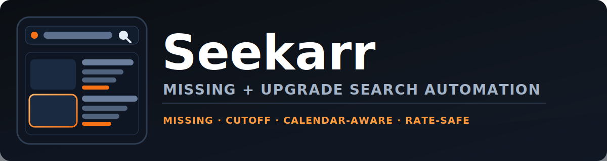

# Seekarr

<p align="center">
  
</p>

<p align="center">
  <a href="https://github.com/tumeden/seekarr/actions/workflows/quality.yml"></a>
  <a href="https://github.com/tumeden/seekarr/actions/workflows/security.yml"></a>
  <a href="https://github.com/tumeden/seekarr/actions/workflows/docker.yml"></a>
  <a href="https://github.com/tumeden/seekarr/actions/workflows/workflow-lint.yml"></a>
  <a href="https://github.com/tumeden/seekarr/actions/workflows/dockerfile-lint.yml"></a>
  <a href="https://github.com/tumeden/seekarr/releases"></a>
  
  
  
  <a href="https://hub.docker.com/r/tumeden/seekarr"></a>
  <a href="https://github.com/tumeden/seekarr/pkgs/container/seekarr"></a>
  <a href="https://ko-fi.com/tumeden"></a>
  
</p>

Seekarr keeps your Radarr and Sonarr stack actively searching for missing media and better releases over time, so you do not have to keep manually triggering searches yourself.

Seekarr is configured from the Web UI. Arr instance URLs, API keys, schedules, and search behavior are stored in SQLite.

<!-- screenshots -->


---

## What It Does

- Re-runs searches for monitored movies and episodes that are still missing.
- Keeps checking for better releases when you want ongoing upgrades, not just first-time grabs.
- Lets you set different schedules and behavior for each Radarr or Sonarr instance.
- Helps avoid wasteful searches with release delays, quiet hours, cooldowns, and rate limits.

Upgrade source modes:

- `Wanted List Only`: only search items Arr is currently asking to upgrade.
- `Monitored Items Only`: search monitored items that already have files so Seekarr can keep looking for better releases.
- `Both`: combine Arr's current upgrade list with monitored items that already have files.

---


## Docker Quick Start

### Docker Images

The image is available on both Docker Hub and GitHub Container Registry:

- **Docker Hub**: `tumeden/seekarr:latest`
- **GHCR**: `ghcr.io/tumeden/seekarr:latest`

### Docker Compose

```yaml
services:
  seekarr:
    image: tumeden/seekarr:latest
    container_name: seekarr
    restart: unless-stopped
    ports:
      - "8788:8788"
    # environment:
    #   - PUID=1000
    #   - PGID=1000
    volumes:
      - ./data:/data
```

Then:

1. Start container.
2. Open `http://localhost:8788`
3. Set Web UI password.
4. Configure Radarr/Sonarr instances and settings in **Settings**. You can add or remove multiple instances for either app from the UI.

By default the container stores data in `/data/seekarr.db`.

### Updating

To update Seekarr to the latest version:

```bash
docker compose pull
docker compose up -d
```

---

## Persistence

Persist `./data`.

It contains:

- `seekarr.db` (state + Web UI settings)
- `seekarr.masterkey` (key used to decrypt stored Arr API keys)

Web UI setting changes are stored in `seekarr.db`.

If you need to fully reset Seekarr's configured instances and UI settings, stop the app and delete `seekarr.db`. Keep `seekarr.masterkey` unless you intentionally want to discard access to stored API keys as well.

---

## Security

- Web UI requires a password (stored as salted hash in SQLite).
- Arr API keys entered in Web UI are stored encrypted in SQLite.
- Do not lose `seekarr.masterkey`, or stored API keys cannot be decrypted.

---

## Common Errors

- Connection refused/unreachable: Arr URL/port is wrong or unreachable from container.
- HTTP 401/403: Arr API key is invalid.

---

## Related Projects

- Need help cleaning up stuck or failed downloads? [Decluttarr](https://github.com/ManiMatter/decluttarr)
- Looking for library maintenance automation for Plex/Jellyfin? [Maintainerr](https://github.com/Maintainerr/Maintainerr)
